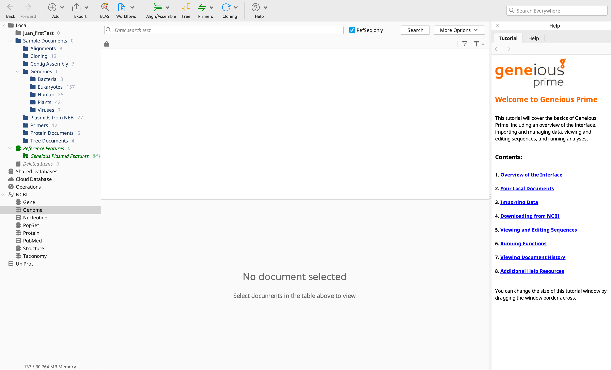

---
Geneious is a high-level bioinformatics software suitable to conduct a series of Molecular Biology tasks, including sequence analysis, visualization and database exploration.
The Faculty of Veterinary Medicine of the University of Calgary  has purchased a floating license, which operates through a virtual machine that can accessed remotely from any terminal in Campus (UofA) or remotely. In both cases, a VPN connection is required.

Instructions to use geneious:

1. Go to https://www.geneious.com/download/ and download the Geneious Prime app installation file appropriate for your operating system.
   
2. Login into the FortiClient VPN.
   
3. After you install the software and run it, you will be prompted to activate the license:

Click on 'Activate license' and you will be transferred to the following dialogue box

4. Enter your credentials:
   

Enter you email, click on 'License Server' and enter the IP address of the floating license server (you can get such IP from your PI). After you add the IP address and click on 'Activate'. If everything works properly, the Geneious software will start and you will see something like this:

IMPORTANT INFORMATION

Please make sure you close Geneious after you finish your working session to allow others to be able to use the software too. For now, the Faculty only have 5 licenses that can be used simultaneously. The number of licenses may be increased depending on the demand of the software.
